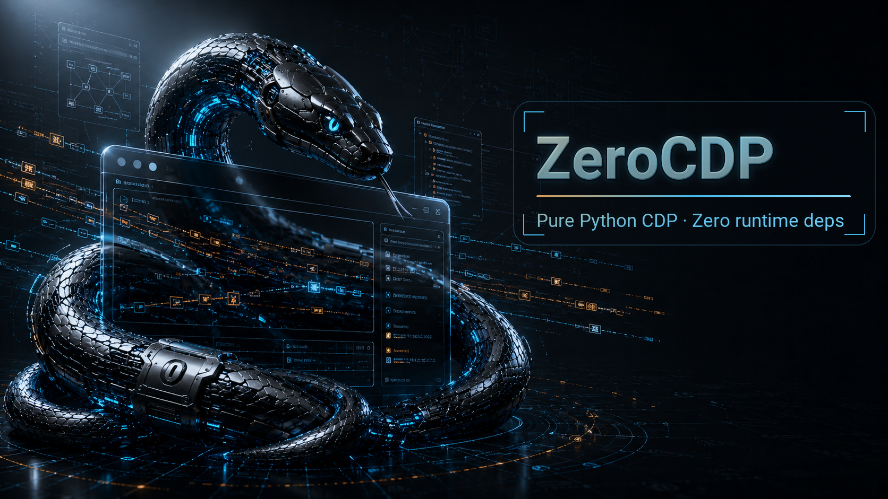
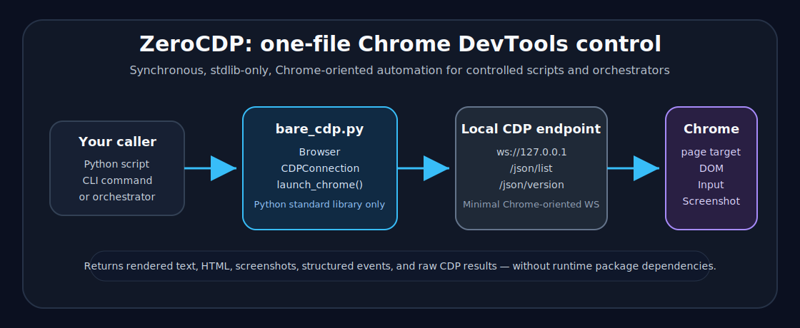

# ZeroCDP

<p align="center">
  <strong>One Python file. No runtime dependencies. Drive Chrome over raw CDP.</strong><br>
  A small, synchronous Chrome DevTools Protocol client for scripts, CLIs, tests, and orchestrators.
</p>

<p align="center">
  <a href="https://github.com/0xTitanas/zero-cdp/actions/workflows/ci.yml"></a>
  
  
  
  
</p>

<p align="center">
  
</p>

---

**ZeroCDP** is a compact Python browser-control layer for cases where installing a full automation framework is the wrong trade. It speaks directly to the **Chrome DevTools Protocol** through a minimal Chrome-oriented WebSocket path implemented with the Python standard library.

It is intentionally not Playwright, Selenium, or a browser farm. It is a vendorable actuator: connect to Chrome, run CDP commands, navigate, evaluate JavaScript, extract text/HTML, fill simple forms, press keys, and take screenshots from a synchronous script.

<p align="center">
  
</p>

## Why this exists

Sometimes you don’t need a full browser automation framework. You need a small browser primitive that can be dropped into another system and audited in one sitting.

ZeroCDP is built for:

- locked-down, offline, or dependency-constrained machines where Python and Chrome are available;
- internal scripts and smoke checks that need browser control without a framework install;
- orchestrators that want explicit, synchronous browser verbs;
- projects that need one file they can vendor and inspect;
- CDP experiments where raw protocol access matters more than abstraction.

## Diligence snapshot

| Area | Current state |
| --- | --- |
| Project stage | Alpha-quality small library; current release `v0.2.3` |
| Runtime | Python 3.9+; CI runs 3.9, 3.10, 3.11, 3.12, 3.13 |
| Runtime dependencies | None; imports only Python standard-library modules |
| Browser target | Chrome/Chromium-compatible CDP endpoint |
| API model | Synchronous; one command or event wait at a time per `CDPConnection` |
| Default launch posture | `launch_chrome()` uses Chrome-selected ephemeral CDP ports and disposable profiles by default |
| Network behavior | Talks to the configured Chrome DevTools endpoint; no model/API/service calls |
| Credential behavior | Does not request or store credentials; callers must avoid dumping authenticated page data |
| CI coverage | Unit/protocol/config/CLI/import/package checks with a fake CDP server, plus a narrow automated live-Chrome smoke on Linux |
| Security posture | Repository policy in [SECURITY.md](SECURITY.md), with local debugging endpoint guidance in [docs/security.md](docs/security.md); not a sandbox |
| Claims deliberately withheld | No Playwright-level actionability, no cross-browser abstraction, no async client, no stealth claims |

## Quickstart

### Option A: let ZeroCDP launch Chrome

```python
from zero_cdp import Browser, launch_chrome, terminate_chrome

launch = launch_chrome(headless=True)  # ephemeral CDP port + temp profile by default
browser = Browser(port=launch.port)
try:
    url = "data:text/html,%3Ctitle%3EZeroCDP%3C%2Ftitle%3E%3Cmain%3EHello%20from%20ZeroCDP%3C%2Fmain%3E"
    browser.navigate(url)
    print(browser.evaluate("document.title"))
    print(browser.extract_text())
finally:
    browser.close()
    terminate_chrome(launch)
```

Equivalent CLI smoke path:

```sh
python -m zero_cdp --launch --new-tab about:blank --navigate "data:text/html,%3Ctitle%3EZeroCDP%3C%2Ftitle%3E%3Cmain%3EHello%20from%20ZeroCDP%3C%2Fmain%3E" --extract-text
```

Expected text includes:

```text
Hello from ZeroCDP
```

### Option B: connect to an existing Chrome debug port

Start Chrome yourself with a dedicated automation profile and the hardened local-debugging shape from
[docs/security.md](docs/security.md):

```text
chrome \
  --remote-debugging-port=9222 \
  --user-data-dir=/tmp/zero-cdp-profile \
  --no-first-run \
  --no-default-browser-check \
  --disable-extensions
```

Then connect:

```python
from zero_cdp import Browser

browser = Browser(host="127.0.0.1", port=9222)
browser.navigate("https://example.com")
print(browser.extract_text())
browser.close()
```

`Browser` connects lazily on the first action. Use `connection = browser.connect()` when you want to keep the underlying `CDPConnection` object explicitly.

## Installation

### Copy one file

Copy `zero_cdp.py` into your project and import it:

```python
from zero_cdp import Browser
```

If you vendor the file, preserve the module header metadata so downstream users can find the canonical source, license, and issue tracker.

### Install from source

```sh
git clone https://github.com/0xTitanas/zero-cdp.git
cd zero-cdp
python -m pip install .
```

After installation, the `zero-cdp` console script is available alongside `python -m zero_cdp`.

Project links:

- Source: https://github.com/0xTitanas/zero-cdp
- Issues: https://github.com/0xTitanas/zero-cdp/issues
- License: [MIT](LICENSE)

## Current capabilities

| Capability | Supported surface |
| --- | --- |
| Connect to Chrome | `Browser(...)`, `CDPConnection(...)`, `discover_ws_url(...)` |
| Launch Chrome | `launch_chrome(...)`, config launch mode, CLI `--launch` |
| Target discovery | `/json/list`, `/json/version`, `/json/new` helpers |
| New tabs / target selection | `browser.new_tab(...)`, `browser.select_target(...)`, CLI `--new-tab` |
| Navigation | `navigate(..., wait=True)` with loader-correlated lifecycle waits |
| JavaScript evaluation | `evaluate(...)` and raw `call("Runtime.evaluate", ...)` |
| Selectors | `wait_for_selector(...)`; invalid CSS raises `SelectorError` |
| Interaction primitives | `click(...)`, `input_text(...)`, `press(...)` for controlled pages and smoke checks |
| Extraction | `extract_text(...)`, `extract_html(...)` |
| Screenshots | `screenshot(path=None, format="png")` |
| Raw CDP | `call(method, params=None, timeout=None, session_id=None)` |
| Sessions/events | `CDPSession`, `ANY_SESSION`, `wait_for_event(...)`, `recent_events(...)` |
| CLI | `python -m zero_cdp` and `zero-cdp` console script |
| Config | JSON config plus environment variable overrides |

## Architecture

Text fallback for the diagram above:

1. A Python script, shell command, or orchestrator calls `zero_cdp.py`.
2. `Browser` manages endpoint discovery, optional Chrome launch, target selection, and owned connections.
3. `CDPConnection` serializes WebSocket access and sends JSON-RPC CDP commands.
4. Chrome executes the command against a page target.
5. ZeroCDP returns structured command results, bounded event history, rendered text, HTML, screenshots, or raw CDP data.

The core keeps concurrency simple: one command or event wait owns a connection at a time. For parallel browser work, open separate connections, use separate browser processes, or let the caller's orchestrator own fan-out.

## Configuration

Create a default config:

```sh
RUN_DIR="$(mktemp -d)"
python -m zero_cdp --write-default-config "$RUN_DIR/zero-cdp.json"
```

Example config:

```json
{
  "chrome": {
    "mode": "connect",
    "host": "127.0.0.1",
    "port": null,
    "ws_url": null,
    "executable": null,
    "user_data_dir": null,
    "headless": true,
    "extra_args": []
  },
  "timeouts": {
    "default": 10.0
  }
}
```

`chrome.port: null` is mode-dependent: connect mode derives `9222`, while launch mode derives `0` so Chrome chooses an ephemeral debugging port. `ws_url` is connect-mode only; launch mode rejects it to avoid controlling a browser other than the one it just spawned.

ZeroCDP validates config types strictly: `mode` must be `"connect"` or `"launch"`, `headless` must be a JSON boolean, `extra_args` must be a list of strings, ports must be integers, and timeouts must be finite positive numbers.

Environment overrides:

| Variable | Meaning |
| --- | --- |
| `ZERO_CDP_HOST` | Debugging host |
| `ZERO_CDP_PORT` | Debugging port |
| `ZERO_CDP_WS_URL` | Direct WebSocket debugger URL |
| `ZERO_CDP_CHROME` | Chrome/Chromium executable path |
| `ZERO_CDP_USER_DATA_DIR` | Chrome user-data directory |
| `ZERO_CDP_HEADLESS` | `true` / `false` / `1` / `0` |
| `ZERO_CDP_TIMEOUT` | Default timeout in seconds |

See [docs/configuration.md](docs/configuration.md) for the full reference.

## CLI

```sh
python -m zero_cdp --help
zero-cdp --help
```

Common examples:

```text
# Extract rendered text from a launched disposable Chrome
python -m zero_cdp --launch --navigate https://example.com --extract-text

# Open a new tab, connect to that target, then run follow-on actions
python -m zero_cdp --new-tab https://example.com --eval "document.title"

# Screenshot
python -m zero_cdp --launch --navigate https://example.com --screenshot example.png
```

`--launch --new-tab` must be paired with a follow-on action such as `--eval`, `--navigate`, `--extract-text`, or `--screenshot`; otherwise the CLI refuses the command before launching Chrome.

## API overview

```python
from zero_cdp import (
    Browser,
    CDPConnection,
    CDPError,
    CDPConnectionError,
    CDPProtocolError,
    CDPTimeoutError,
    CDPCommandError,
    NavigationError,
    SelectorError,
    CDPEvent,
    CDPSession,
    LaunchedChrome,
    ANY_SESSION,
    discover_ws_url,
    list_targets_from_port,
    new_tab_from_port,
    launch_chrome,
    wait_until_ready,
    terminate_chrome,
)
```

Common page actions exposed on both `Browser` and `CDPConnection`:

- `call(method, params=None, timeout=None, session_id=None)`
- `wait_for_event(event_name, predicate=None, timeout=None, session_id=None, after_sequence=None)`
- `event_cursor()` / `recent_events()` / `dropped_event_count`
- `attach_session(target_id)` / `attach_to_target(target_id)`
- `navigate(url, wait=True, timeout=None, wait_until="load")`
- `wait_for_ready_state(states=("interactive", "complete"), timeout=None)`
- `evaluate(expression, return_by_value=True, timeout=None)`
- `wait_for_selector(selector, timeout=None)`
- `click(selector)`
- `input_text(selector, text, clear=True, press_enter=False)`
- `press(key)`
- `extract_text(selector=None)`
- `extract_html(selector=None)`
- `screenshot(path=None, format="png")`
- `close()`

Endpoint and process helpers such as `discover_ws_url(...)`, `list_targets_from_port(...)`,
`new_tab_from_port(...)`, and `wait_until_ready(...)` cover Chrome's `/json/*` discovery endpoints
and launch readiness polling. Prefer `attach_session(...)` for new code; `attach_to_target(...)`
is kept as a compatibility helper that returns only the flattened `sessionId`.

## Security notes

Chrome remote debugging is powerful. Treat the debugging endpoint as local control of the browser profile.

Recommended defaults:

- Bind to `127.0.0.1`, not `0.0.0.0`.
- Do not expose the debugging port through a reverse proxy or routable network address.
- Use a dedicated automation profile.
- Prefer ZeroCDP-owned temporary profiles for CI and untrusted pages.
- Do not log cookies, tokens, local storage, or raw authenticated page dumps.
- Do not automate password or 2FA entry through generic scripts.

See [SECURITY.md](SECURITY.md) for vulnerability reporting and [docs/security.md](docs/security.md) for the full local-debugging safety reference.

## Limits and non-goals

ZeroCDP deliberately does not provide:

| Non-goal | Current position |
| --- | --- |
| Full Playwright/Selenium replacement | Use those when you need mature cross-browser automation and locator semantics |
| Async API | Not implemented; use threads/processes/separate connections if needed |
| Browser farm management | Out of scope |
| Stealth / anti-detection | Out of scope |
| HAR/video/tracing wrappers | Reachable through raw CDP, not wrapped |
| Request interception wrappers | Reachable through raw CDP, not wrapped |
| Frame/shadow-DOM convenience layer | Not wrapped yet |
| Production-grade actionability engine | `click`, `input_text`, and `press` are best-effort primitives for controlled pages |

See [docs/limitations.md](docs/limitations.md) for details.

## Development

Run the local verification set:

```sh
python -m py_compile zero_cdp.py tests/test_zero_cdp.py tests/test_live_chrome.py examples/*.py
python -m unittest discover -s tests -v
python -m zero_cdp --help
python -S -c "import sys; sys.path.insert(0, '.'); import zero_cdp; print(zero_cdp.__version__)"
```

The tests use only the Python standard library. They include a fake WebSocket/CDP server for handshake behavior, frame masking, CDP routing, events, selector safety, navigation waits, WebSocket control frames, screenshots, endpoint discovery, config validation, and process cleanup.

The `examples/` directory contains small scripts for navigation/extraction, raw CDP calls, config-driven runs, form filling, and launch/screenshot flows; the development command above compiles those examples as part of the local smoke set.

Current CI runs the unit/protocol/import/package checks on Ubuntu across Python 3.9–3.13. A narrow live-Chrome smoke now runs on Linux; broader live-browser coverage remains manual release verification.

## Documentation map

- [docs/configuration.md](docs/configuration.md) — config file, environment variables, launch/connect defaults
- [SECURITY.md](SECURITY.md) — vulnerability reporting and supported security posture
- [docs/security.md](docs/security.md) — remote debugging and profile safety
- [docs/limitations.md](docs/limitations.md) — current limits and non-goals
- [CHANGELOG.md](CHANGELOG.md) — release history
- [CONTRIBUTING.md](CONTRIBUTING.md) — development contribution notes
- [LICENSE](LICENSE) — MIT license

## Roadmap

Near-term items that fit the project boundary:

- Windows launch smoke coverage;
- broader live-browser smoke coverage beyond the current narrow Linux job;
- stricter but still lightweight interaction checks for controlled pages;
- optional generated CDP method helpers;
- packaged single-file release artifact.

Items that remain intentionally outside the current claim: a general WebSocket client, stealth automation, Playwright-level locators, and a large async framework.

## Similar projects

If you need more abstraction or typed protocol wrappers, look at Playwright, Selenium, pychrome, PyChromeDevTools, PyCDP / chrome-devtools-protocol, or zerodep CDP.

ZeroCDP is for the narrower niche where **small, auditable, stdlib-only, directly vendorable browser control** is the primary goal.

## License

MIT. See [LICENSE](LICENSE).
